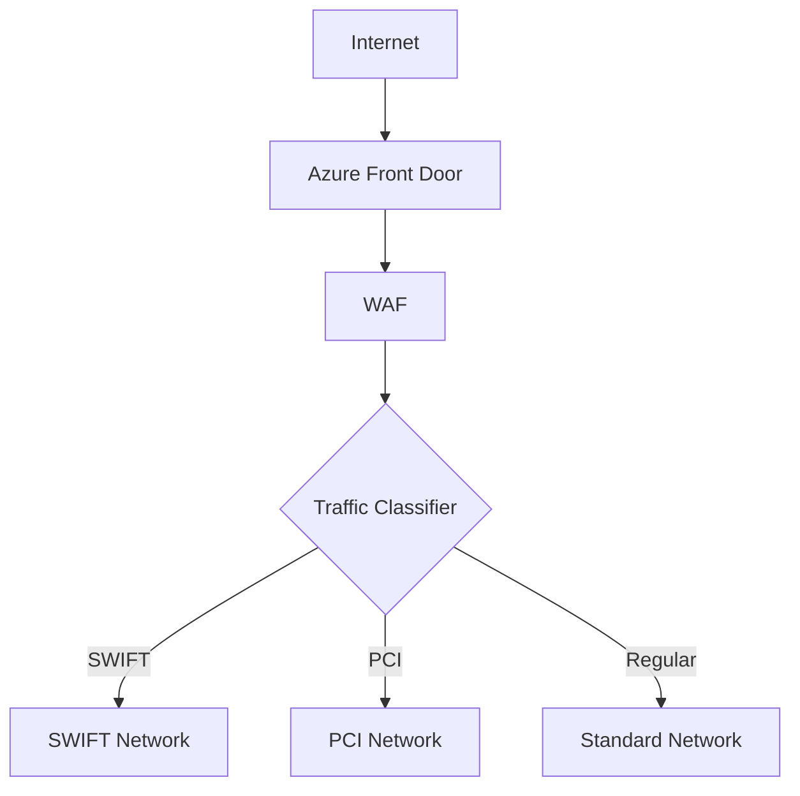

# Security Architecture Overview

## Zero Trust Implementation

Our Zero Trust architecture implements the following core principles:

### 1. Identity-Based Access Control
- HSM-backed identity management
- Just-in-Time (JIT) access
- Multi-factor authentication (MFA)
- Privileged Identity Management (PIM)

### 2. Network Microsegmentation

### 3. Real-Time Monitoring
- Continuous compliance validation
- Behavioral analytics
- Anomaly detection
- Automated response

## Security Controls Matrix

| Control Category | Implementation | Validation Frequency |
|-----------------|----------------|---------------------|
| Network Security| NSGs, Azure Firewall | 5 minutes |
| Identity Management | Azure AD PIM | 1 minute |
| Encryption | Azure Key Vault HSM | Continuous |
| Compliance | Azure Policy | 5 minutes |

## Compliance Framework Integration

### PCI-DSS Controls
- Requirement 1: Network Security
- Requirement 3: Data Encryption
- Requirement 7: Access Control
- Requirement 10: Monitoring

### SWIFT Customer Security Controls
- SWIFT CSCF v2023
- Real-time monitoring
- Network isolation