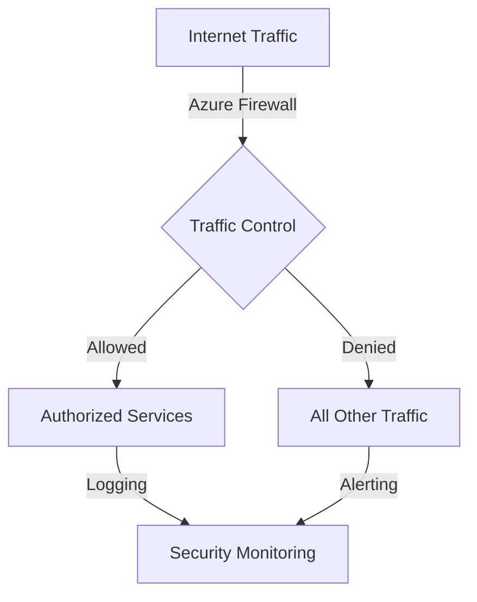

# Regulatory Framework Control Mapping

## PCI DSS to Azure Controls Mapping

| PCI Requirement | Azure Control | Implementation | Validation |
|----------------|---------------|----------------|------------|
| 1.1 | NSG Rules | Network Security Groups | Automated testing |
| 3.4 | Key Vault HSM | RSA-4096 Keys | Real-time monitoring |
| 7.1 | Azure AD PIM | Just-in-Time Access | Continuous validation |

## SWIFT CSP to Azure Controls Mapping

### 1. Restrict Internet Access

### 2. Privileged Access Management
- Azure AD Privileged Identity Management
- Just-in-Time Access
- Multi-Factor Authentication