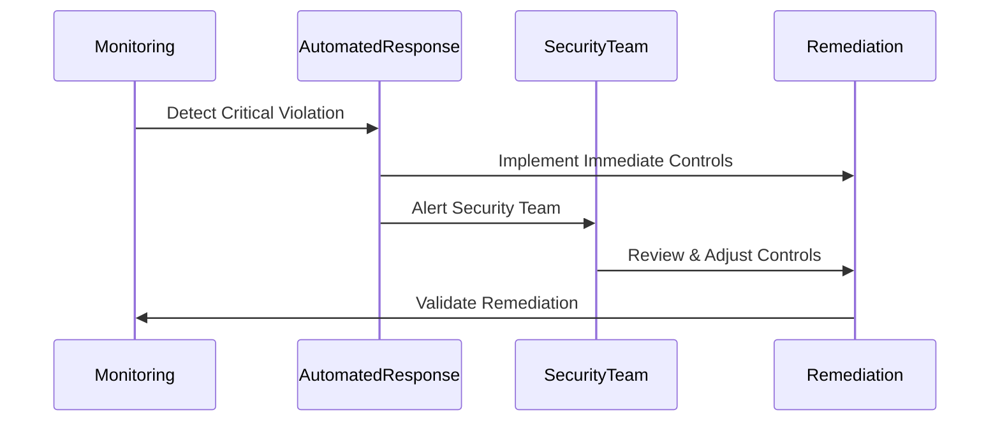

# Security Incident Response Procedures

## Automated Response Workflows

### 1. Critical Security Violations


### 2. Response Procedures by Severity

#### Critical (P0)
1. Immediate automated network isolation
2. Security team notification (SLA: 5 minutes)
3. Incident bridge establishment
4. Stakeholder communication

#### High (P1)
1. Automated policy enforcement
2. Security team notification (SLA: 15 minutes)
3. Investigation initiation

## Recovery Procedures

### Network Security Recovery
```bash
# Validate network isolation
./scripts/validate-network-isolation.sh

# Restore secure configuration
./scripts/restore-security-baseline.sh

# Verify compliance
./scripts/verify-compliance.sh
```

### Encryption Recovery
```bash
# Rotate compromised keys
./scripts/rotate-hsm-keys.sh

# Validate key rotation
./scripts/validate-key-rotation.sh
```